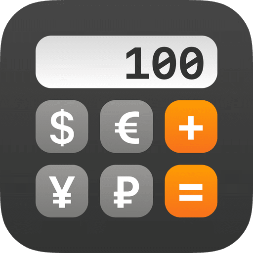

# Conversor de Monedas
**Challengue from Alura Latam**




## Descripción

Este proyecto es una aplicación de consola en Java que permite realizar conversiones de monedas utilizando la API de ExchangeRate-API. El usuario puede seleccionar entre diferentes opciones de conversión de divisas, visualizar el resultado y volver al menú principal o salir del programa.

## Estructura del Proyecto

El proyecto está organizado en las siguientes carpetas y clases:

- **App**: Contiene la clase `Principal`.
- **Librerias**: Contiene la biblioteca `Gson-2.10.1.jar`.
- **Modelos**: Contiene las clases `Menus` y `Monedas`.
- **Servicios**: Contiene las clases `ConversorMonedas`, `GestorConversor` y `Opciones`.

## Requisitos

- JDK 8 o superior
- Librería Gson (`Gson-2.10.1.jar`)
- Conexión a internet para acceder a la API de ExchangeRate-API

## Configuración

1. Clonar el repositorio o descargar los archivos del proyecto.
2. Asegurarse de tener `Gson-2.10.1.jar` en el classpath del proyecto.
3. Reemplazar la variable `apiKey` en la clase `Principal` con tu propia clave de API de ExchangeRate-API.

## Uso

Para ejecutar el programa, simplemente compila y ejecuta la clase `Principal`.

```java
package app;

import servicios.Opciones;

public class Principal {
    public static void main(String[] args) {
        String apiKey = "6b039e45d888194efc48ffc4";  // Reemplazar con tu propia API key
        Opciones menu = new Opciones(apiKey);
        menu.mostrarMenu();
    }
}
```

# Clases y Funcionalidades

## Clase Principal
La clase ``Principal`` contiene el método ``main`` que inicia el programa y muestra el menú principal.

## Clase Menus
La clase ``Menus`` define varios métodos para mostrar diferentes menús en la consola:

- ``menuInicial():`` Muestra el menú principal.
- ``menuDivisas():`` Muestra el menú de opciones de conversión de divisas.
- ``opcionIncorrecta():`` Muestra un mensaje cuando el usuario ingresa una opción inválida.
- ``saliendoDelPrograma():`` Muestra un mensaje cuando el usuario decide salir del programa.

## Clase Monedas
La clase ``Monedas`` maneja las conversiones de moneda. Utiliza la clase ``GestorConversor`` para obtener las tasas de cambio y realiza las siguientes conversiones:

- ``convertirDolarAPesoArgentino()``
- ``convertirPesoArgentinoADolar()``
- ``convertirDolarARealBrasileno()``
- ``convertirRealBrasilenoADolar()``
- ``convertirDolarAPesoColombiano()``
- ``convertirPesoColombianoADolar()``

## Clase ConversorMonedas
La clase ``ConversorMonedas`` se comunica con la API de ExchangeRate-API para obtener las tasas de cambio actuales.

## Clase GestorConversor
La clase ``GestorConversor`` utiliza ConversorMonedas para realizar las conversiones de moneda.

## Clase Opciones
La clase ``Opciones`` extiende la clase ``Menus`` y maneja la interacción del usuario con el menú, llamando a los métodos adecuados de la clase ``Monedas`` según la opción seleccionada por el usuario.

# Ejecución del Programa
1. Ejecutar la clase ``Principal``.
2. El programa mostrará el menú principal donde el usuario puede seleccionar una opción de conversión o salir.
3. Según la opción seleccionada, el programa solicitará la cantidad a convertir y mostrará el resultado de la conversión.
4. El usuario puede seguir realizando conversiones o salir del programa.

# Ejemplo de Ejecución
```css
╔════════════════════════════════════════════╗
║     BIENVENIDO AL CONVERSOR DE MONEDAS     ║
╠════════════════════════════════════════════╣
║                                            ║
║ Por favor elija la opción deseada [1-2]    ║
║                                            ║            
║ 1. Realizar una conversión de divisas      ║                                        
║ 2. Salir                                   ║
║                                            ║
╚════════════════════════════════════════════╝
1
╔════════════════════════════════════════════╗
║     BIENVENIDO AL CONVERSOR DE MONEDAS     ║
╠════════════════════════════════════════════╣
║                                            ║
║ Por favor elija la opción deseada [1-7]    ║
║                                            ║
║ 1. Dólar --> Peso argentino                ║
║ 2. Peso argentino --> Dólar                ║
║ 3. Dólar --> Real brasileño                ║
║ 4. Real brasileño --> Dólar                ║
║ 5. Dólar --> Peso colombiano               ║
║ 6. Peso colombiano --> Dólar               ║
║ 7. Salir                                   ║
║                                            ║
║                                            ║
╚════════════════════════════════════════════╝
5
════════════════════════════════════════
Convertidor de dólar a peso colombiano
════════════════════════════════════════
Por favor ingrese la cantidad de dolares[USD] que desea convertir a pesos colombianos[COP]: 
200
╔════════════════════════════════════╗
║Convertir de dólar a peso colombiano║
╚════════════════════════════════════╝
║                                    ║
║ Cantidad convertida: 200 USD
║-------------------------------------
║ Resultado: 767,074.8 COP
╚════════════════════════════════════╝

╔════════════════════════════════════════════╗
║     BIENVENIDO AL CONVERSOR DE MONEDAS     ║
╠════════════════════════════════════════════╣
║                                            ║
║ Por favor elija la opción deseada [1-2]    ║
║                                            ║
║ 1. Realizar una conversión de divisas      ║
║ 2. Salir                                   ║
║                                            ║
║                                            ║
╚════════════════════════════════════════════╝

2
╔═══════════════════════════════════╗
║ SALIENDO DEL PROGRAMA....         ║
╚═══════════════════════════════════╝
```
El usuario selecciona una opción, por ejemplo, ``1`` para realizar una conversión de divisas y el menú correspondiente se muestra para seleccionar la conversión específica.

# Autor
**Daniel Cano**

# Licencia
Este proyecto está bajo la Licencia MIT.
